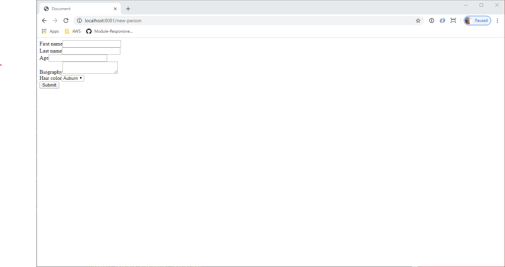
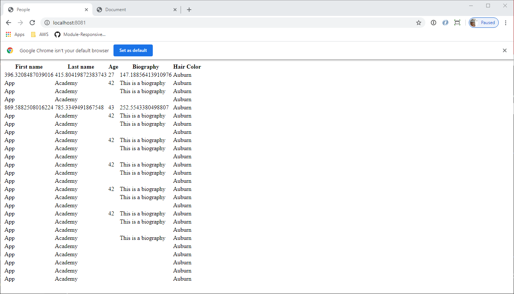

# Express Application Practice Assessment

**Note:** To read this in a rendered view, open your VS Code Command Palatte
(using Control+Shift+P on Windows, Command+Shift+P on macOS) and choose
"Markdown: Open Preview" or "Markdown: Open Preview to Side".

In this assessment, you are asked to create an Express application. You will
create an Express application that

* Has a page that shows a list of people
* Has a page that allows you to add a person
* Is protected from Cross-Site Request Forgeries

In the **images** directory, you will find

* A screenshot of the person listing page
* A screenshot of the person creation form

The screenshots show you what is expected from a _structure_ standpoint. They
are meant to be guides. The tests will _not_ make any assertions about the
styling of your pages, merely the structure of the pages and the data presented
on them.

Use the technologies you have used up to this point. They are all installed in
the **package.json** for your convenience.

* Express.js
* pg (the library to connect to PostgreSQL), Sequelize, and Sequelize CLI
* CSURF middleware
* Pug.js
* cookie-parser middleware
* body-parser middleware
* nodemon (for development purposes)

A **package.json** file already exists with the dependencies. Please run **`npm
install`** to install those before doing your development and running your tests.
Do not remove any dependencies already listed in the **package.json**.

## Running the application

You can run your application in "dev" mode. The **nodemon** package is installed
and runnable from `npm run dev`.

## Running the tests

This is "black-box testing". The tests will _only_ use your Express application.
It will not make connections to the database or directly test your route
handlers. They will merely make HTTP requests of your Express app and analyze
the responses.

To ease your development, tests will run against your **development** database
and _not_ the test database.

**You** will be responsible for creating, migrating, and seeding the data in
your development database.

Run your tests with `npm test`. You can run `npm test test/test-file-name.js`
to run the tests for a specific part of the assessment.
  - Example: To only run the test `01-form-page.js` do, 
    `npm test test/01-form-page.js`

If you get tired of seeing all of the Sequelize failures, you can try running:

```
npm test 2> /dev/null
``` 

That should redirect the annoying messages into oblivion but leave the
mocha output available for you to read. This may prevent you from seeing other
errors, though, so make sure to run it without the `2> /dev/null` if you're 
trying to get a test to pass and need to see error output.

## App Requirements

These are the requirements for the application. Follow them closely. The tests
will attempt to read data from your rendered HTML. 

Read all of the requirements. Determine the data needed to include in your data
model.

Please use port 8081 for your Express.js server.

### The database

Create a database user with `CREATEDB` priveleges:
* The login username that you must use is "express_practice_app"
* The login password that you must use is "EzB5Dxo2dabnQBF8"

Initialize Sequelize in your assessment and use the following configuration in
your `config/config.json` file:

```json
{
  "development": {
    "username": "express_practice_app",
    "password": "EzB5Dxo2dabnQBF8",
    "database": "express_practice_development",
    "host": "127.0.0.1",
    "dialect": "postgres",
    "seederStorage": "sequelize",
    "logging": false
  }
}
```

Remove `logging: false` if you want to see SQL output in your terminal when 
running tests with `npm test`. 

Create the `development` database with those configurations.

For this assessment, the tests will be using your `development` database
configuration defined in the `config.json` file. **The tests will not be
testing your database explicitly, but test specs DO rely on you setting up the
database AND database constraints properly.** 

You will need to generate and run the migrations, models, and seeders. There is 
no need to run `npm test` until after doing this.

### The data model

You will need to store "People" data and "HairColor" data.

Generate a model (and migration) for the "HairColor" model with the attributes:

| Attribute name | Attribute type | Constraints          |
|----------------|----------------|----------------------|
| color          | string         | unique, not nullable |

- the "color" column will hold values up to 20 characters in length and 
  will not allow `NULL`s 

Generate a model (and migration) for the "People" model with the attributes:

| Attribute name | Attribute type | Constraints                         |
|----------------|----------------|-------------------------------------|
| firstName      | string         | not nullable                        |
| lastName       | string         | not nullable                        |
| age            | integer        |                                     |
| biography      | text           |                                     |
| hairColorId    | integer        | not nullable, references HairColors |

Configure the migration so that:

- the "firstName" column will hold values up to 50 characters in length and 
  will not allow `NULL`s 
- the "lastName" column will hold values up to 50 characters in length and 
  will not allow `NULL`s
- the "hairColorId" will not allow `NULL`s and references the "HairColors"
  table

Create a seeder file for `HairColors`:

```js
{ color: "Auburn", createdAt: '2019-04-12', updatedAt: '2019-04-12'},
{ color: "Black", createdAt: '2019-04-12', updatedAt: '2019-04-12' },
{ color: "Blonde", createdAt: '2019-04-12', updatedAt: '2019-04-12' },
{ color: "Brown", createdAt: '2019-04-12', updatedAt: '2019-04-12' },
{ color: "Other", createdAt: '2019-04-12', updatedAt: '2019-04-12' },
{ color: "Red", createdAt: '2019-04-12', updatedAt: '2019-04-12' },
{ color: "White", createdAt: '2019-04-12', updatedAt: '2019-04-12' },
```

If you set up the seeder correctly, the `HairColors` data should have the
following pre-defined data in it:

| color  |
|--------|
| Auburn |
| Black  |
| Blonde |
| Brown  |
| Other  |
| Red    |
| White  |

**NOTE:** All of the data constraints for this assessment can be handled by the
database with the `allowNull` and `unique` flags in your migrations. You **do
not** need to use form validations in this project. They are good to have, in
real applications, but can require too much time for you to integrate them into
this project. Again, you **do not** need to use a form validator, just use
database constraints and let the errors turn into 500 status codes by Express.

Make sure to make the appropriate associations.

After you've generated your models, migrations, and seeder files, don't forget
to migrate and seed your database with the appropriate Sequelize CLI commands.

### Your main file

You must use the **app.js** file to create and configure your Express
application. You must store the instance of your Express.js application in a
variable named "app". That is what is exported at the bottom of the **app.js**
file.

Set up your CSRF middleware to use cookies.

### The route "GET /new-person"

This page shows a form in which a visitor can add a new person. The form must
have

* a method of "post"
* an action of "/new-person"

In the form, you should have these inputs with the provided name:

| Field HTML name | Field type       | Constraints | Default values                             |
|-----------------|------------------|-------------|--------------------------------------------|
| firstName       | single-line text | required    |                                            |
| lastName        | single-line text | required    |                                            |
| age             | number           |             |                                            |
| biography       | multi-line text  |             |                                            |
| hairColorId     | dropdown         | required    | One of the pre-defined hair colors         |
| _csrf           | hidden           |             | The value provided by the CSURF middleware |

You should also have a submit button.

Please refer to the screenshot below:



### The route "POST /new-person"

The post handler should validate the data from the HTTP request. If everything
is fine, then it should create a new person and redirect to the route "/".

Remember, all of the data constraints for this assessment can be handled by the
database with the `allowNull` and `unique` flags in your migrations. You **do
not** need to use form validations in this project. They are good to have, in
real applications, but can require too much time for you to integrate them into
this project. Again, you **do not** need to use a form validator, just use
database constraints and let the errors turn into 500 status codes by Express.

If the data does not pass validation, then no new record should be created. It
is ok to just let Express return an error code of 500 in this case. **Note**:
you would not do this in a real application.

### The route "GET /"

When someone accesses your application, they should see a list of people that
are stored in your database. The list should contain:

* The person's first name
* The person's last name
* The person's age
* A short biography
* Their hair color

Please refer to the screenshot below:



To create a table in a Pug.js template, you'll use something like the following
code. You probably already know this, but it's included for your reference.

```pug
table
  thead
    tr
      th Header 1
      th Header 2
  tbody
    each thing in things
      tr
        td= thing.property1
        td= thing.property2
```

The tests will use a regular expression to determine if each piece of data is
wrapped with TD tags. For example, to test for the "Auburn"
value appearing in the HTML of the page, the tests would use the following
regular expression.

```
<td[^>]*>\s*Auburn\s*</td>
```

The regular expression will ignore any attributes that you put on the table data
tag as well as any white space around the entry for the data value.

Again, the styling is not important to the tests.