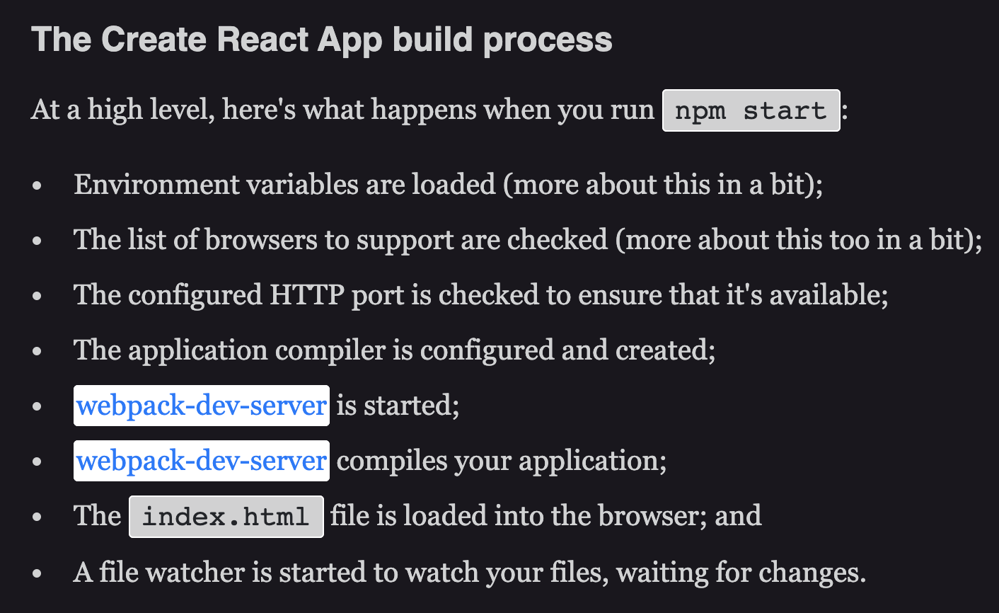

# React Builds
## What is a Front End Build?
It is a simplified/streamlined version of your application.
### Mhm... but why do I need one?
Browsers love it when code is optimized for them! Javascript extensions (CSS libraries) make it easier for us to code, but 

## NPM Start

## Before Deploying a React App into a Production Environment (ex: Heroku)

1. Define/expose env variables that are NOT secret.
2. Configure supported browsers
3. Run the command `npm run build` in the root directory of your React project.

## External Resources
* a/A Walkthrough - About 2/3rds of the way down [this reading](https://open.appacademy.io/learn/js-py---may-2020-online/week-14-may-2020-online/react-builds)
* [React Docs on Deploying an app to Production](https://create-react-app.dev/docs/deployment/)