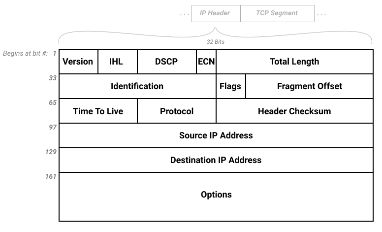
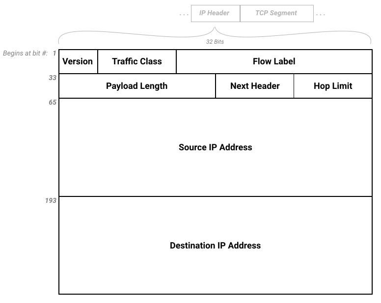

## TCP/IP History
- The Transmission Control Protocol and Internet Protocol were broken apart from the original Transmission Control Program.
- TCP is responsible for fault-tolerance between networks, allowing for data to be re-sent if it fails to reach its destination
- IP is responsible for the end-to-end nature of networks, allowing data to be sent and received from each host, eliminating a single central system that could take down a whole network

## Packet-Switching
- A packet is how data is broken up to be sent across a network
- Each packet has metadata stored in headers as well as a body with the content that is being sent

## Bits and Bytes sidenote
- a bit is a binary digit, 0 or 1
- a byte is eight bits
  - 01001101 is a byte that would represent (1 + 4 + 8 + 64) = 77 in our standard decimal format

## IPv4
- Best known version of IP, finalized back in 1983
- Consists of a series of at least 13 fields, each with a specified length
- The first field is the version, which is the four bits that represent version 4: `0100`
- The next 10 fields after the version specify metadata about the packet, such as header length and protocol (what kind of data is being transferred).
- The last two required fields are the source IP address and the destination IP address, which guide the packet along the internet to its destination.
- We also have a final `Options` field, which is very rarely used. Typically any metadata needed to be transferred would be caught by one of the previous fields. (Unnecessary example: a Router Alert, which tells every router to evaluate this packet, even if it's not the final destination)

- Overall, if we do not have any extra options, our packet header is 160 bits, or 20 bytes long.
- An IPv4 address is a series of 4 octets, meaning 4 8-bit binary numbers, which as we saw is one byte each.
  - 192.18.1.1 -> 11000000.00010010.00000001.00000001
  - This format allows for approximately 4 billion unique addresses

## IPv6
- Finalized in 2017, the main goal was to expand the number of addresses available, but also restructures and consolidates our packet headers.
- We now only use 8 fields:
  1. Version: Just like IPv4, the first four bits of our packet header represent our version number, which is `0110`, representing our decimal 6.
  2. Traffic Class: Identifies the type of packet data
  3. Flow Label: Adds packet sequencing to IP, but is experimental
  4. Payload Length: Specifiies the size of this packet
  5. Next Header: Typically identifies the Transport Layer protocol (TCP, UDP, etc.). It can also indicate an extension header is present, where extra options for the packet are specified (similar concept to the Options field of IPv4, but a different, chainable implementation)
  6. Hop Limit: Decremented by one each time this packet passes through an intermediary. Prevents the packet from being passed around forever.
  7. Source IP Address
  8. Destination IP Address

- Overall, our packet header is 320 bits, or 40 bytes long
- IPv6 addressess take up the majority of a packet header. They are 128 bits long each vs IPv4's 32 bit addresses. Theyu are typically represented by "eight colon-ed hexadecimal"
  - 2600:6c5e:157f:d48c:138f:e0ba:6fa7:d859 -> 0010011000000000:0110110001011110:0001010101111111:1101010010001100:0001001110001111:1110000010111010:0110111110100111:1101100001011001
  - The expansion of the address length now allows for approximately 350 undecillion addresses (3.5×10^38) instead of IPv4's 4 billion.

## Localhost Address
- A special address that references your current machine.
  - IPv4: 127.0.0.1
  - IPv6: ::1
- Also referred to as the loopback address (the machine is referring to itself)

## All interfaces Address
- An address that accepts all interfaces on a network
  - IPv4: 0.0.0.0
  - IPv6: ::
- We wouldn't send a packet to this address, it just indicates that if we are listening on this address we are looking at all packets that pass through on the network.

# Main Takeaways
1. TCP vs IP
- TCP is responsible for fault-tolerance between networks, allowing for data to be re-sent if it fails to reach its destination
- IP is responsible for the end-to-end nature of networks, allowing data to be sent and received from each host, eliminating a single central system that could take down a whole network
2. Packet Switching
- Data is sent in packets, with headers that have metadata about the packet
3. Packet Structure
- The packet header always starts with the version number, followed by other metadata fields, then the source and destination addresses
- The TCP segment (next section!) then follows the IP headers
4. Version Field
- IPv4: `0100`, which is 4 in decimal notation
- IPv6: `0110`, which is 6 in decimal notation
5. Special Addresses
- Localhost: References the current machine
  - IPv4: 127.0.0.1
  - IPv6: ::1
- All interfaces: Receives all incoming packets on a network
  - IPv4: 0.0.0.0
  - IPv6: ::