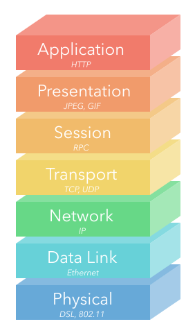

## TCP/IP Model (IP Suite)

1. Given a diagram of the TCP/IP model, be able to label each layer
2. Give a brief description of each layer (What is its major concern and an example)
  - Application: User-facing data, such as HTTP or FTP (file transfer)
  - Transport: Connectivity between clients and servers, such as TCP or UDP
  - Internet: Routing between separate networks, such as IP
  - Link: Low-level communication between local resources on a network, such as Ethernet
3. Each layer of the model encapsulates the previous.
  - For example, the application layer is the data that is being transferred, but the transport layer surrounds this data with transport protocols (such as TCP headers), which are surrounded by IP packets defined by protocols of the internet layer, which are sent along an ethernet cable with standards defined in the link layer.

## OSI Model - **OPTIONAL**

1. Given a diagram of the OSI model, be able to label each layer
2. Give a brief description of each layer
- Application (Layer 7)
  - Example: HTTP
  - Information used by client-side software
- Presentation (Layer 6)
  - Example: JPEG, GIF
  - Data gets translated into a presentable format
  - Often called the syntax layer since it translates machine-readable syntax into human-readable syntax
- Session (Layer 5)
  - Example: RPC (Remote Procedure Call)
  - Authentication and data continuity
  - Authorize actions, reestablish session from dropped connections
- Transport (Layer 4)
  - Example: TCP, UDP
  - Mirrors TCP/IP's Transport Layer
  - Focused on data integrity and connectivity
- Network (Layer 3)
  - Example: IP
  - Mirrors TCP/IP's Internet Layer
  - Manages connections between different remote networks
- Data Link (Layer 2)
  - Example: Ethernet
  - Connections between one network interface to another
  - Primarily used by machines in a local network (ie targeting different MAC addresses)
- Physical (Layer 1)
  - Example: DSL, 802.11 (Wi-Fi)
  - Translating from electrical signals to bits of data

## Internet Protocol
1. TCP vs IP
- TCP is responsible for fault-tolerance between networks, allowing for data to be re-sent if it fails to reach its destination
- IP is responsible for the end-to-end nature of networks, allowing data to be sent and received from each host, eliminating a single central system that could take down a whole network
2. Packet Switching
- Data is sent in packets, with headers that have metadata about the packet
3. Packet Structure
- The packet header always starts with the version number, followed by other metadata fields, then the source and destination addresses
- The TCP segment (next section!) then follows the IP headers
4. Version Field
- IPv4: `0100`, which is 4 in decimal notation
- IPv6: `0110`, which is 6 in decimal notation
5. Special Addresses
- Localhost: References the current machine
  - IPv4: 127.0.0.1
  - IPv6: ::1
- All interfaces: Receives all incoming packets on a network
  - IPv4: 0.0.0.0
  - IPv6: ::

## Transport Protocol
1. Transport protocols define the middlemen between our Application Layer (HTTP) and our Internet Layer (IP). Converts the data that the applications are communicating with into segments that can be transferred by our IP packets.
2. Ports define which application/service our segments are intended for at a destination IP address.
3. TCP is a reliable transport protocol that protects against loss of data.
- Good use case: HTTP, file transfers, media streaming (YouTube, etc.)
4. UDP is an unreliable transport protocol that prioritizes speed.
- Good use case: real-time communication like live video and VoIP, DNS (prioritizing speed here)

## TCP Connections
1. TCP Segments allow for reliable data transfer and consistent connections
2. The segment headers come directly after the IP packet headers and right before the unit of data that is being transferred.
3. Control flags are used to indicate the different parts of the TCP connection lifecycle.
4. Acknowledgements are sent after each segment. The acknowledgment number is based off of the sequence number that was sent and the length of the data in the segment. Inconsistencies in these numbers indicate segments need to be resent (providing reliable data transfer).

## Domain Name System (DNS)
1. Domains are the friendly names that we can refer to instead of having to remember IP addresses
2. Top-level domains (TLDs) are the right-most part of the URL before application routes. Moving left we get second-level, third-level, etc., subdomains
- For https://open.appacademy.io/learn/js-py--feb-2020-online/
  - Top-level domain: io
  - Second-level domain: appacademy
  - Third-level domain: open 
3. Domains are tracked using DNS records in zone files that are maintained by name servers. These records map to IP addresses.
4. There are several common DNS record types. Be familiar with each:
- SOA: Start of Authority. Points to a name server that is the primary authority for the domain. This record is present on every name server.
- NS: Name Servers. Points to name servers for the zone. There will always be at least two name servers per zone for redundancy.
- A / AAAA: Map a resource directly to an IP address. These are the ultimate records that our queries are looking for. `A` records are used for IPv4 addresses and `AAAA` records are used for IPv6 addresses.
- CNAME: Acts as an alias, indicating what resource this domain should also point to. (We often see this with the www subdomain, where a CNAME record for www would exist for google.com, indicating we can request `www.google.com` and get the same response as `google.com`)
- MX: Mail Exchanger. Used to direct messages to a mail server instead of an IP address (allows us to use `@gmail.com` instead of `@123.45.67.89` - which is obviously not the actual address)

## Network Hardware
1. Three main categories of hardware devices are hubs, switches, and routers
2. A hub will broadcast to everything that it's connected to. It is generally considered a Layer 1 (Physical Layer) device.
3. A switch is able to pass data to a specific device on a network if it already has a reference (forward), or it can broadcast to all devices (flood) if its MAC address is not in its table yet. It is generally considered a Layer 2 (Data Link Layer) device.
4. A router connects a local network to other networks. A single IP address is used for external communication, then the router can forward to the IP addresses used on the internal network. It is generally considered a Layer 3 (Network Layer) device.