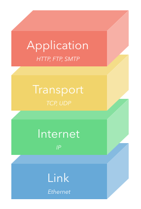
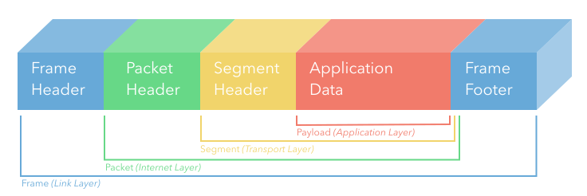

## TCP/IP Model
- Transmission Control Protocol / Internet Protocol reference model
- More practical model of the two, focusing on getting data from one place to another

## Layers of the TCP/IP Model
  ### Application
  - User-facing data
  - HTTP and FTP
  - Anything that is transmitted from the Tansport Layer is considered Application Layer data

  ### Transport
  - TCP and UDP
  - Connectivity between and clients and servers
  - Relies on lower layers to establish network connectivity

  ### Internet
  - IP
  - Data is processed in packets
  - Routing is handled with IP addresses
  - Connects separate networks together

  ### Link
  - Low-level communication standards
  - Aren't concerned with type of data, focus on getting data from one local network resource to another
  - When we are concerned with other networks, we go to the internet layer

  ### (*)Physical
  - Not an official layer! Included here because some people will break this out unofficially
  - Electrical concepts like transmission across wires, conversion of electricity into bits

## Encapsulation

- The layers of the TCP/IP model represent an encapsulation of data
- The Link Layer frame includes the whole stack, for example, while a Transport Layer segment includes the segment header and the Application Layer's payload.

## Main Takeaways
1. Given a diagram of the TCP/IP model, be able to label each layer
2. Give a brief description of each layer (What is its major concern and an example)
  - Application: User-facing data, such as HTTP or FTP (file transfer)
  - Transport: Connectivity between clients and servers, such as TCP or UDP
  - Internet: Routing between separate networks, such as IP
  - Link: Low-level communication between local resources on a network, such as Ethernet
3. Each layer of the model encapsulates the previous.
  - For example, the application layer is the data that is being transferred, but the transport layer surrounds this data with transport protocols (such as TCP headers), which are surrounded by IP packets defined by protocols of the internet layer, which are sent along an ethernet cable with standards defined in the link layer.