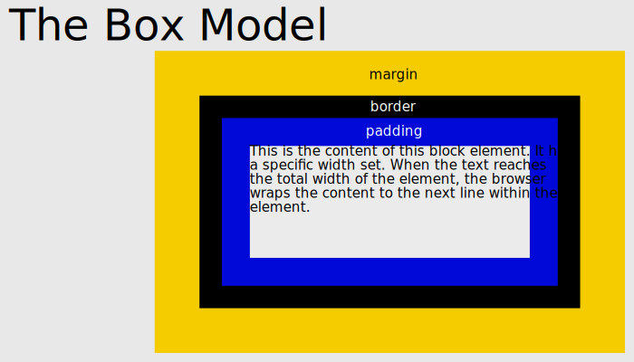

# The Box Model

* Every DOM element has a box around it
* Gift/Package metaphor
    * Content: item being shipped
    * Padding: packing peanuts, [bubble-wrap](https://codepen.io/Calvein/pen/qOpbJL)
    * Border: package
    * Margin: wrapping paper (admittedly, this is a VERY thin margin)
* 
* `box-sizing`
    * `content-box` vs `border-box`
    * Does the measurement of a box with `boxsizing: border-box;`include:
        * content?
        * padding?
        * border?
        * margin?
* `margin: 0 auto;`