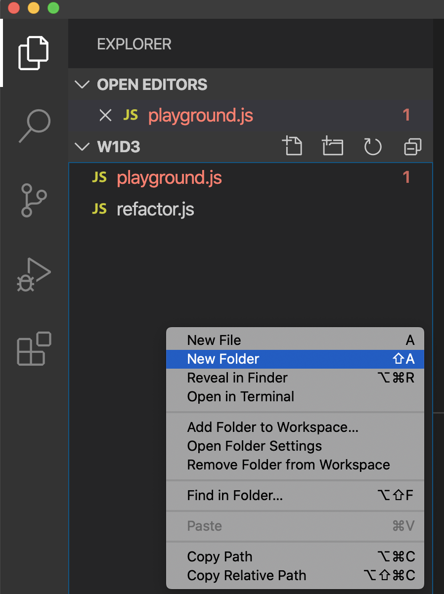

## Review of Week 2 Day 1 Learning Objectives

### 1. Match the commands ls, cd, pwd to their descriptions

```bash
$ pwd #  =  print working directory
$ cd  #  =  change directory
$ ls  #  =  list files in the current directory
```

### 2. Given a folder structure diagram, a list of 'cd (path)' commands and target files, match the paths to the target files.

```
project
│   README.md
│   file001.txt    
│
└───folder1
│   │   file011.txt
│   │   file012.txt
│   │
│   └───subfolder1
│       │   file111.txt
│       │   file112.txt
│       │   ...
│   
└───folder2
    │   file021.txt
    │   file022.txt
```


How would you go about reaching subfolder1 and all it's contents?

Note: assume your current working directory is `project`

Terminal:

```bash
$ cd folder1/subfolder1
```

### 3. Use VSCode to create a folder. Within the folder create a .js file containing console.log('hello new world'); and save it.

To do so using the GUI follows a normal patterm:



But often we want to add a folder using the console:

Terminal:

```bash
$ mkdir name_of_project # creates the folder in your current directory (possibly your Documents folder)
$ cd name_of_project # change directory into the project folder you just created
$ touch hello.js # create the file where you will write out the function
$ code . # shortcut that opens VSCode with the current working directory
```

After VSCode opens type the code into a new file

```js
console.log("hello new world");
```

Note: Remember to save your file frequently: (`CMD + S` on mac, `Crtl + S` in other environments)

### 4. Use node to execute a JavaScript file in the terminal

```
project
│   README.md
│   file001.txt    
│
└───folder1
│   │   file011.txt
│   │   file012.txt
│   │
│   └───subfolder1
│       │   file111.txt
│       │   file112.txt
|       |   hello.js
│       │   ...
│   
└───folder2
    │   file021.txt
    │   file022.txt
```


Terminal:

```bash
$ cd project # change directory into the project folder 
$ cd folder1 # change directory into folder1 folder
$ cd subfolder1 # change directory into subfolder1
$ code . # shortcut that opens VSCode with the project folder
```

From within VSCode, use the keyboard shortcut `` Ctrl + ` `` to open the builtin terminal.

```bash
$ node hello.js
```
